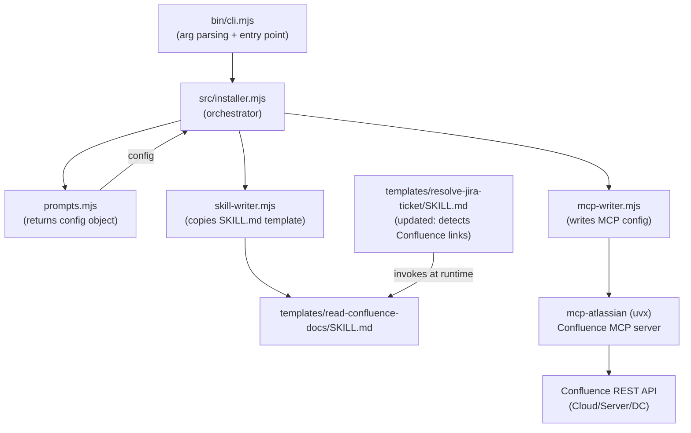

# System Design & Architecture — Confluence Reader Skill

## Architecture Overview
**What is the high-level system structure?**



**Key components:**
- **`bin/cli.mjs`**: thin entry point — parses args, delegates entirely to `src/installer.mjs`
- **`src/installer.mjs`**: orchestrates the install flow; calls prompts then writers in sequence
- **`prompts.mjs`**: collects Confluence URL and credentials from the user (or env vars in `--yes` mode), returns a `config` object
- **`mcp-writer.mjs`**: builds and writes the `confluence` MCP server entry alongside `jira`
- **`skill-writer.mjs`**: copies the `read-confluence-docs/SKILL.md` template to the tool-specific skill directory
- **`detect-tool.mjs`**: defines per-tool path configuration (extended for Confluence skill directory)
- **`templates/read-confluence-docs/SKILL.md`**: the AI skill that guides agents on how to read Confluence
- **`templates/resolve-jira-ticket/SKILL.md`**: updated to detect Confluence links in tickets and chain into `read-confluence-docs`

**Technology stack:**
- Same as existing: Node.js ESM, `mcp-atlassian` via `uvx`, no new runtime dependencies

## Data Models
**What data do we need to manage?**

**Config object extension** (returned by `runPrompts` / `runNonInteractive`):
```js
{
  // existing Jira fields...
  jiraUrl, jiraToken, jiraAuthMethod, jiraEmail, projectKey,

  // new Confluence fields:
  confluenceEnabled: boolean,      // did user opt in?
  confluenceUrl: string,           // e.g. https://mycompany.atlassian.net/wiki
  confluenceAuthMethod: string,    // 'api_token' | 'personal_token'
  confluenceEmail: string,         // only for api_token auth
  confluenceToken: string,         // API token or PAT
}
```
> `confluenceSpaceKey` is **out of scope** for this iteration — no user story or success criterion covers it. The skill can search across all spaces without a default.

**MCP server entry** added to `.mcp.json`:
```json
{
  "mcpServers": {
    "confluence": {
      "command": "uvx",
      "args": ["mcp-atlassian"],
      "env": {
        "CONFLUENCE_URL": "<url>",
        "CONFLUENCE_API_TOKEN": "<token>",
        "CONFLUENCE_USERNAME": "<email>"
      }
    }
  }
}
```
> For Personal Token auth: use `CONFLUENCE_PERSONAL_TOKEN` instead of `CONFLUENCE_API_TOKEN` + `CONFLUENCE_USERNAME`.

## API Design
**How do components communicate?**

**Confluence MCP tools** (verified against [mcp-atlassian tools reference](https://mcp-atlassian.soomiles.com/docs/tools-reference#confluence-tools)):

| Tool | Purpose |
|------|---------|
| `confluence_search` | Full-text search using CQL |
| `confluence_get_page` | Fetch a page by ID or URL |
| `confluence_get_page_children` | List child pages of a page |
| `confluence_get_comments` | Get comments on a page |
| `confluence_get_page_history` | Get revision history of a page |
| `confluence_get_labels` | Get labels on a page |
| `confluence_get_page_images` | Get images attached to a page |

> Note: `confluence_get_space` does **not** exist in `mcp-atlassian` — do not reference it.
> Read-only tools only — write tools (`confluence_create_page`, `confluence_update_page`, `confluence_delete_page`, etc.) exist but are out of scope (non-goal: read-only access only).

**Jira MCP tools** relevant to `resolve-jira-ticket` Confluence link detection (verified against [mcp-atlassian tools reference](https://mcp-atlassian.soomiles.com/docs/tools-reference#jira-tools)):

| Tool | Purpose |
|------|---------|
| `jira_get_issue` | Fetch full ticket including description, comments, remote links (use `fields: '*all'`) |
| `jira_search` | Search tickets via JQL |

> Note: there is **no** `jira_get_comments` tool — comments are included in `jira_get_issue` response with `fields: '*all'`.

**Internal interfaces (installer):**
- `buildMcpServers(config)` in `mcp-writer.mjs` — extended to add `confluence` entry when `config.confluenceEnabled`
- `installConfluenceSkill(projectRoot, toolKey)` in `skill-writer.mjs` — new dedicated function, mirrors `installSkill()` but targets `read-confluence-docs` template and tool config paths
- `uninstallConfluenceSkill(projectRoot, toolKey)` in `skill-writer.mjs` — counterpart for uninstall
- `TOOL_CONFIGS` in `detect-tool.mjs` — each tool config extended with `confluenceSkillDir` and `confluenceSkillFile` fields

## Component Breakdown
**What are the major building blocks?**

### New Files
- `templates/read-confluence-docs/SKILL.md` — the Confluence reader skill template

### Modified Files
- `src/prompts.mjs` — add Confluence configuration prompts (step 4, optional)
- `src/writers/mcp-writer.mjs` — add `confluence` MCP server to `buildMcpServers()`; add `'confluence'` to `serversToRemove` in `uninstallMcp()`
- `src/writers/skill-writer.mjs` — add `installConfluenceSkill()` and `uninstallConfluenceSkill()` (no changes to existing `installSkill()`)
- `src/detect-tool.mjs` — add `confluenceSkillDir` and `confluenceSkillFile` to each entry in `TOOL_CONFIGS`
- `src/installer.mjs` — call `installConfluenceSkill()` / `uninstallConfluenceSkill()` in the install/uninstall loops when `config.confluenceEnabled`
- `templates/resolve-jira-ticket/SKILL.md` — add Confluence link detection in Phase 2 and invoke `read-confluence-docs`

> `src/writers/settings-writer.mjs` — **no changes needed**. It only stores `JIRA_PROJECT_KEY` (a non-secret runtime key). Confluence URL and token are already included in the MCP server `env` block; no duplication required.

### Existing File: `templates/read-confluence-docs/SKILL.md`
The skill guides the AI agent to:
1. Accept a Confluence URL, page ID, or search query from the user
2. Use `confluence_search` or `confluence_get_page` to fetch content
3. Summarize and present the documentation
4. Offer to read child pages or related pages
5. Surface the content as context for subsequent implementation tasks

## Design Decisions
**Why did we choose this approach?**

| Decision | Choice | Rationale |
|----------|--------|-----------|
| Reuse `mcp-atlassian` | Yes | Already a dependency; Confluence support is built-in via env vars |
| Separate `confluence` MCP entry vs. shared with `jira` | Separate entries | Allows independent auth config; some teams use different credentials for Confluence |
| Optional Confluence in installer | Yes (opt-in) | Not all projects use Confluence; backwards compatibility |
| Generalize `skill-writer.mjs` vs. add separate function | Add `installConfluenceSkill()` — no changes to existing `installSkill()` | Simpler change, zero risk of breaking existing Jira skill install |
| Confluence URL vs. auto-detecting from Jira URL | Ask user, pre-fill from Jira URL | Atlassian Cloud uses `/wiki` suffix on same domain; pre-fill saves typing |

**Alternatives considered:**
- A separate `mcp-confluence` server — rejected because `mcp-atlassian` already covers it
- Embedding Confluence reading into `resolve-jira-ticket` skill only — rejected because Confluence is useful independently

## Non-Functional Requirements
**How should the system perform?**

- **Backwards compatibility:** existing Jira-only installations must be unaffected; Confluence is purely additive
- **Security:** Confluence token stored in MCP config's `env` block (same approach as Jira); never logged or printed
- **Idempotency:** running the installer twice overwrites existing config entries (same behavior as current Jira install)
- **Error handling in skill:** if `confluence_get_page` fails (not found, access denied), the skill should report the error clearly and ask the user for an alternative URL or search term
